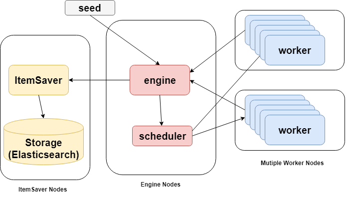

# Crawler RPC
Some RPC services for my web crawlers in another [project](https://github.com/Victor515/dating-website-crawler).

## Features

* Highly Scalable crawler worker services
* Independent data storage services that could be maintained and deployed separately

## Architecture

